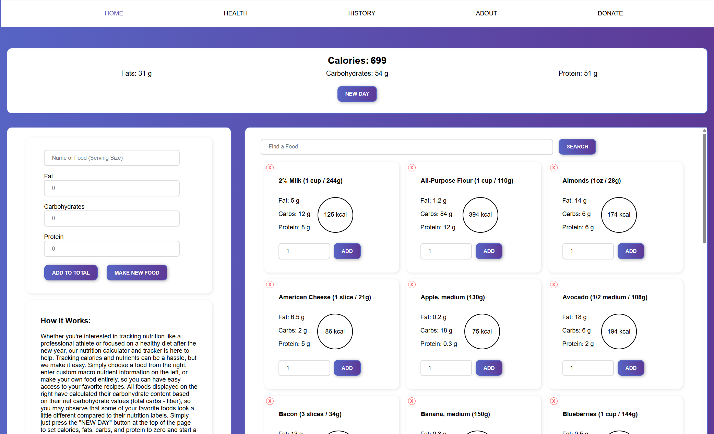

# MacroMuncher

**MacroMuncher** is a student-built web application created to help users tailor meals based on individual macronutrient goals—developed by Luke Brenningmeyer during his undergraduate computer science studies.

## Demo

Below is a screenshot of the homepage:

> You can clone the repo and open `index.html` in your browser to try it locally.

## Features

- Track macronutrient goals like protein, carbs, and fats 
- Analyze meals over the course of your history using the site
- View visual breakdowns of macros per meal  
- Tracks meal history and customization choices  
- Customize ingredient portions for balanced nutrition  

## Technologies Used

- **Frontend**: HTML5, CSS3, JavaScript  
- **API/Logic**: Internal recipe logic for calculating macronutrient values  
- **Responsive Design**: Works across desktop and mobile devices 
